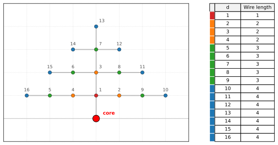

# Simplified Explicit Communication Model

Bill Dally ([*On the Model of Computation*, CACM
2022](https://cacm.acm.org/opinion/on-the-model-of-computation-point/))
proposed modeling algorithm data movement explicitly on the Manhattan
grid.

This is a simplified implementation of that model for a single
processor, designed to price a single function call.



- Processor is at the origin, memory is arranged as a 2D grid in the
  upper half-plane around it.
- Every cell is linearly indexed; `ceil(sqrt(idx))` gives the Manhattan
  distance from the core.

## Cost model (what is priced)

- **Reads are priced.** The cost of a read is the Manhattan distance
  from the core to the cell being read.
- **Writes are free.**
- **Arithmetic is free.**

## Function semantics

- **At the start of a call**, the location of every input byte is
  specified by the caller, in order of Python signature and data-layout.
- **At the end of a call**, the location of every output byte is
  specified by the caller, these incur standard read cost.

## Worked example

```python
def myfunc(a, b, c, d, e):
    return a*b + c*d + e

# IR, using three-address code. op dest,src1,src2
1,2,3,4,5
mul 1,1,2
mul 2,3,4
add 1,1,2
add 1,5
1
```


Put `a→1, b→2, c→3, d→4,e→5`

| step | action                                  | reads             | cost |
|-----:|-----------------------------------------|-------------------|-----:|
| 1    | `t1 = a * b`, write `t1 → 1`            | `a@1`, `b@2`      | 1+2  |
| 2    | `t2 = c * d`, write `t2 → 2`            | `c@3`, `d@4`      | 2+2  |
| 3    | `s  = t1 + t2`, write `s  → 1`          | `t1@1`, `t2@2`    | 1+2  |
| 4    | `r  = s + e`, write `r  → 1`            | `s@1`, `e@5`      | 1+3  |


**Total cost:**
`(1+2) + (2+2) + (1+2) + (1+3) + 1 = 15`.
