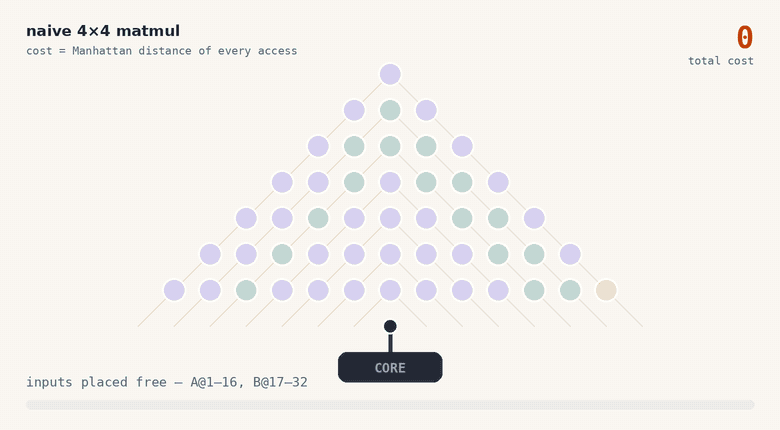

# Explicit Communication Models

Bill Dally ([*On the Model of Computation*, CACM
2022](https://cacm.acm.org/opinion/on-the-model-of-computation-point/))
proposed modeling algorithm data movement explicitly on a Manhattan grid.
This repository describes models inspired by that approach and versioned
instruction sets for programs running on them.

## Models

Each model has its own specification under [`models/`](models/).

| Model | Description | Status |
|-------|-------------|--------|
| 1. [Simplified Dally grid model](models/simplified-bill-dally/) | Original/obsolete | Specified |
| 2. [Dally single core with tape](models/single-core-with-tape/) | Grid with one processor, 2 tapes | Specified |
| 3. [Spatial computer](models/spatial-computer/) | A processor at every node. | Placeholder |

## Instruction sets

Choose a **model** to specify the machine, access costs, I/O, and
coordinate bounds, and an **instruction-set version** to specify the available
operations. These are separate choices, subject to the model's I/O support.
See [`instruction-sets/`](instruction-sets/) for versions v0–v4.

The existing v0–v3 operations retain their meanings. [v4](instruction-sets/v4/)
adds `recv d` and `send s` for sequential 32-bit tape I/O. Receiving writes
the next input word to `d`; sending appends the word from `s` to the output.
The single-core-with-tape model excludes these operations from its energy
and time scores to focus on solution-dependent computation. Other
instructions are charged for their scratch reads and writes.

## Existing model animation

The [live matmul animation](https://cybertronai.github.io/simplified-dally-model/)
illustrates **model 1**, with its original distance-based bill. Its animation
clocks do not represent the physical timing of model 2.

The original geometry, function-call semantics, and worked example are in the
[simplified Bill Dally model specification](models/simplified-bill-dally/).
