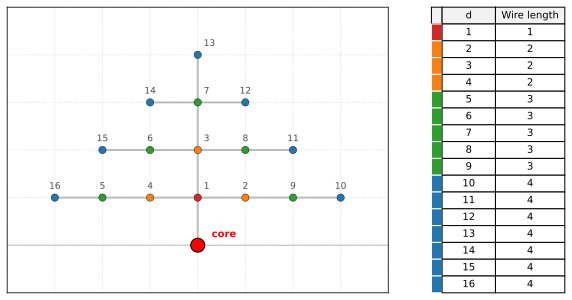

# Simplified Bill Dally model

Bill Dally ([*On the Model of Computation*, CACM
2022](https://cacm.acm.org/opinion/on-the-model-of-computation-point/))
proposed modeling algorithm data movement explicitly on the Manhattan
grid.

This is a simplified implementation of that model for a single
processor, designed to price a single function call.

**[▶ Live animation](https://cybertronai.github.io/simplified-dally-model/)** — a naive
4×4 matmul executed one priced access per clock, with the bill accumulating as it runs.




- Processor is at the origin, memory is arranged as a 2D grid in the
  upper half-plane around it.
- Each cell holds one **32-bit word**.
- Every cell is linearly indexed; `ceil(sqrt(idx))` gives the Manhattan
  distance from the core.

## Cost model (what is priced)

Costs are unitless distance totals. This model does not assign physical energy
or elapsed time to an access.

All modeled cost is absorbed into the associated reads. Arithmetic instructions
charge their source reads; writes and the arithmetic operation itself add no
separate charge.

- **Reads are priced.** The cost of a read is the Manhattan distance
  from the core to the cell being read.
- **Writes are free.**
- **Arithmetic has no additional charge.** Its source reads incur the
  standard read cost. An immediate `set` performs no source read and therefore
  has zero cost in this model.

## Function semantics

- **At the start of a call**, the location of every input 32-bit word is
  specified by the caller, in order of Python signature and data-layout.
- **At the end of a call**, the location of every output 32-bit word is
  specified by the caller, these incur standard read cost.

## Worked example

```python
def myfunc(a, b, c, d, e):
    return a*b + c*d + e

# IR, using three-address code. op dest,src1,src2
1,2,3,4,5
mul 1,1,2
mul 2,3,4
add 1,1,2
add 1,1,5
1
```


Put `a→1, b→2, c→3, d→4,e→5`

| step | action                                  | reads             | cost |
|-----:|-----------------------------------------|-------------------|-----:|
| 1    | `t1 = a * b`, write `t1 → 1`            | `a@1`, `b@2`      | 1+2  |
| 2    | `t2 = c * d`, write `t2 → 2`            | `c@3`, `d@4`      | 2+2  |
| 3    | `s  = t1 + t2`, write `s  → 1`          | `t1@1`, `t2@2`    | 1+2  |
| 4    | `r  = s + e`, write `r  → 1`            | `s@1`, `e@5`      | 1+3  |
| exit | return value read at output address `1` | `r@1`             | 1    |


**Total cost:**
`(1+2) + (2+2) + (1+2) + (1+3) + 1 = 15`.

## Instruction sets

This model supports instruction sets [v0](../../instruction-sets/v0/),
[v1](../../instruction-sets/v1/), [v2](../../instruction-sets/v2/),
[v3](../../instruction-sets/v3/), and the non-tape operations in
[v4](../../instruction-sets/v4/). It has no tape interface: v4 `recv` and
`send` require [Bill Dally's single core with tape](../single-core-with-tape/)
or the [spatial computer](../spatial-computer/).

Choose a machine model separately from an
[instruction-set version](../../instruction-sets/). See the
[models catalog](../) for the available models.
