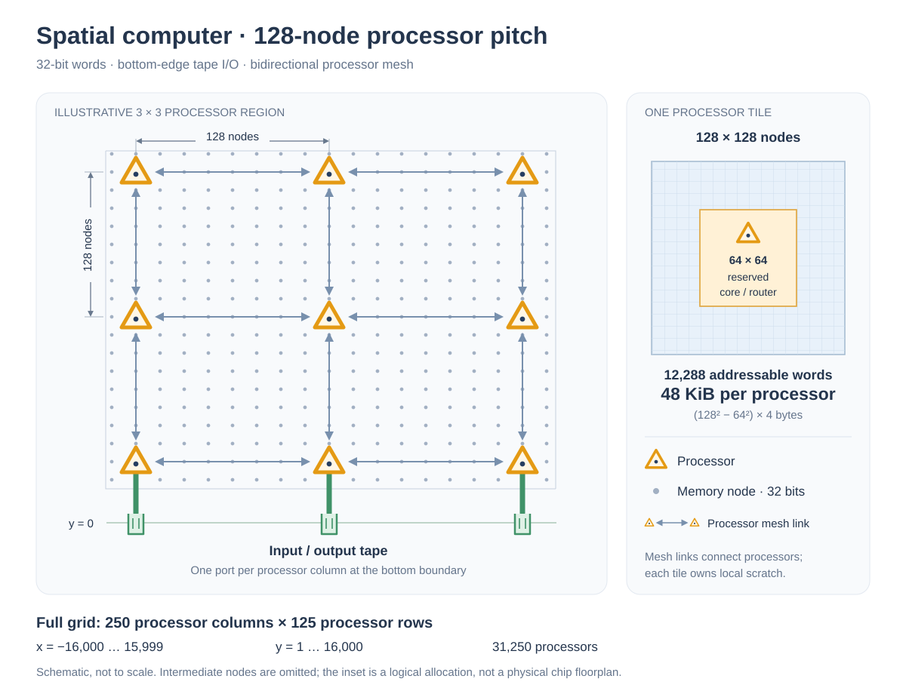

# Spatial computer — pitch 128

Extending simplified Bill Dally's [2D grid model](https://github.com/cybertronai/simplified-dally-model/tree/main/models/simplified-bill-dally) with multiple cores

**Model 3.** A two-dimensional mesh with a processor every **128 grid
nodes in both directions**, **32-bit words**, and input/output tapes along
the **bottom edge, `y = 0`**.

The local memory size and one-word-per-cycle mesh are inspired by
[Cerebras](#calibration-and-scope). This is an abstract machine, not a
simulator of a Cerebras product. Use [instruction set v4](../../instruction-sets/v4/),
with the placement and parallel execution rules below.



## Geometry and memory

A node is one position on the grid, stores one 32-bit word.

| Quantity | Default |
|----------|---------|
| Grid coordinates | `x ∈ [-16,000, 15,999]`, `y ∈ [1, 16,000]` |
| Processor pitch | `p = 128` nodes horizontally and vertically |
| Tile array | 250 columns × 125 rows = **31,250 processors** |
| Tile indices | `i ∈ [0, 249]`, `j ∈ [0, 124]` |
| Positions per tile | `128² = 16,384` |
| Reserved core/router positions | Central `64² = 4,096` per tile |
| Addressable scratch per tile | `12,288` words = **48 KiB** |
| Total scratch capacity | `384,000,000` words = **1.536 GB** (about 1.431 GiB) |
| Tape ports | 250 input/output port pairs, one per tile column |

Tile `(i,j)` contains the positions

```text
x = -16,000 + 128i + u,        u ∈ [0,127]
y =             128j + 1 + v,  v ∈ [0,127]
processor P(i,j) = (-16,000 + 128i + 64, 128j + 64)
bottom port B(i) = (-16,000 + 128i + 64, 0)
```

Positions with **both** `u ∈ [32,95]` and `v ∈ [32,95]` are reserved for
the processor/router and are not scratch addresses. All other positions
in the tile are addressable. The processor coordinate is a nominal center
on the integer grid. Its Manhattan distance to its own scratch cells is
between 32 and 128 node hops.

For a position `(x,y)` inside the bounds, its owning tile is
`i = floor((x + 16,000)/128)`, `j = floor((y - 1)/128)`.
The mesh does not wrap. There are no processors or scratch cells outside
the rectangle; `y = 0` contains only tape ports. Top and side edges carry
no tape I/O. The first and last processor centers are `(-15,936,64)` and
`(15,936,15,936)`.

A run declares a fixed, injective mapping from its 32-bit scratch addresses
to legal memory coordinates. The mapping cannot move values for free.
Scratch begins uninitialized; a source must have been written before it
is read. There are no caches or implicit replicas. All 48 KiB is available
for data; program storage and fixed control state are outside this model.

For continuity with model 2's wire calibration, one node hop represents
**1 µm of modeled wire**. The rectangle therefore has a nominal footprint
of **32 × 16 mm = 512 mm²**. A hypothetical 2 mm bottom I/O band would make
it 32 × 18 mm = 576 mm²; that band supplies no extra scratch or processors.
These are normalized dimensions, not a claim that this many Cerebras
cores and this much SRAM fit on such a die. A 128-node pitch is not a
measured 128 µm Cerebras processor pitch.

## Clock, links, and local accesses

The model clock is **1 ns per cycle**. Each neighboring processor pair
has an independent 32-bit link in each direction. Each directed link
carries at most **one word per cycle**. A transfer starting at boundary
`t` arrives at boundary `t + 1`; its next link transfer or local scratch
access can start at `t + 1`. A FIFO can dequeue and accept a replacement
word in the same cycle. Opposite directions can operate simultaneously. Routers
can forward on distinct links concurrently, including while the local
processor computes. There is no free broadcast or diagonal link.

Each processor's scratch has one access slot per cycle, shared by its own
accesses and requests from other processors. A local read or write takes
**one cycle**, including the local address/data movement. A local access
at Manhattan distance `d` from its owning processor costs:

| Local access | Energy | Time |
|--------------|--------|------|
| Read: 32-bit address plus 32-bit response | `max(50, 2d)` fJ | 1 cycle |
| Write: 32-bit address plus 32-bit data | `max(50, 2d)` fJ | 1 cycle |

The energy floor is inherited from model 2; it is a minimum, not an added
charge. With the reserved central square, all legal local distances are
at least 32, so their distance charge already exceeds the floor. Unlike
model 2, this model uses a one-cycle SRAM latency. A local address/data
access uses the local memory interface, not two serial mesh transfers.

Moving one 32-bit word one node hop costs **1 fJ**. Thus an ordinary
128-node neighbor link costs **128 fJ per word**, and the 64-node link
between a bottom port and its first processor costs **64 fJ per word**.
Both links have one-cycle latency and one-word-per-cycle capacity.
These cycle latencies include modeled wire and router delay: do not add
model 2's 0.4 ps per node on top. No separate router energy is charged.

## Scratch instructions and interprocessor communication

Each v4 instruction runs on a declared processor. Its scratch operands
may belong to any tile. A remote access is an explicit request/reply
protocol over the mesh; it is not a free shared-memory operation.

Requests route horizontally to the owning column, then vertically to
the owning row. Read responses retrace the request path. A remote write
sends its address and data as two successive words on the same path;
there is no acknowledgement packet. Routing tags and fixed control
metadata add no scored words. Each access is unicast.

Let `P` be the issuing processor, `Q` the owning processor,
`L = |i_P - i_Q| + |j_P - j_Q|` the number of mesh links, and `d` the
distance from `Q` to the addressed cell. For **`L > 0`**:

| Access | Energy | Completion latency without contention |
|--------|--------|---------------------------------------|
| Remote read | `256L + max(50, 2d)` fJ | `2L + 1` cycles |
| Remote write | `256L + max(50, 2d)` fJ | `L + 2` cycles |

A read sends one address word, performs the owning tile's local read,
then returns one data word. A write serializes two mesh words, then
performs the local write. For `L = 0`, use the one-cycle local access
table instead. Energy counts each wire segment once per transmitted
word, with the local memory transaction charged separately.

Within an instruction, source reads complete in listed operand order,
then destination writes complete in listed order. Repeated source
operands are each charged. Source values are read before an aliased
destination is overwritten; `select` reads its condition and both values.
For example, `add d,a,b` costs two reads and one write; `copy d,s` costs
one read and one write; `set d,K` costs one write. Arithmetic and
instruction fetch add no separate energy or cycles. A processor waits
for each access to complete before issuing its next access or instruction,
including delivery of a remote write. This is a blocking schedule rule,
not a charge for an acknowledgement packet.

Only the effects already specified by the selected ISA are available.
A scratch `copy` or a remote operand communicates between processors;
v4 `send` continues to mean output to a tape, not a mesh-message opcode.
Workloads must declare their 32-bit numeric interpretation and arithmetic
conventions consistently across compared programs; this model does not
introduce a new numeric ISA.

## Bottom tapes

Port `B(i)` supplies a read-only input tape and a write-only output tape
for column `i`. All processors in that column share those sequential tape
positions; an upper row does not get a new copy of the input. Tapes cannot
be sought, rewound, read back from output, or used as scratch memory.

The workload fixes the per-port streams before evaluating any solution.
The default is **word striping**: word `k` of the global input goes to
port `k mod 250`, at local tape index `floor(k/250)`. Output uses the same
rule in reverse to reconstruct the required global word sequence.
An explicitly declared workload may instead use fixed record or block
striping. Solutions cannot choose a new partition to change their cost.
The harness must specify packing of pixels, labels, or other smaller
values into 32-bit words; `recv` and `send` always transfer a full word.

On processor `P(i,j)`, tape operands must be in **that processor's own
tile**:

```text
recv d    # next word from input port i travels up the column, then writes d
send s    # read s, then carry its word down the column to output port i
```

Let `y_P = 128j + 64` and `q = j + 1`. The path from `B(i)` to `P(i,j)`
has one 64-node bottom link and `j` 128-node mesh links. It carries one
data word, without a scratch-address request to the tape:

| Tape instruction | Energy | Completion latency without contention |
|------------------|--------|---------------------------------------|
| `recv d` | `y_P + max(50, 2d_local)` fJ | `q + 1` cycles |
| `send s` | `max(50, 2s_local) + y_P` fJ | `1 + q` cycles |

Here `d_local` and `s_local` are distances from the issuing processor to
its local operand. The **ribbon-to-processor transport depends only on
height**, with no trip to `x = 0`. The local scratch access is also charged.
Using another column's data requires a charged mesh access or copy after
its owning column receives it; there is no free horizontal ribbon bus.

Calls sharing a tape have an explicit per-port order in the run schedule.
Each input word is delivered to exactly one scheduled `recv`; each `send`
appends at its assigned turn. Input deliveries can be pipelined subject to
link and scratch capacity. Output transfers must preserve append order,
waiting when necessary; there is no free output reorder buffer.
Reading beyond an input stream or reading an uninitialized source is
invalid. Every compared solution consumes the complete fixed input and
produces exactly the required output.

Tape words share the ordinary vertical mesh links with scratch traffic.
Each port can admit one input word and emit one output word per cycle.
The ribbon's aggregate link-capacity bound is therefore **250 words per
cycle = 1 TB/s per direction**, not a guarantee of sustained application
throughput. Contention, scratch service, and instruction dependencies
can reduce it.

**On-chip tape transport and its scratch access are scored.** Physical
off-chip crossing energy, host storage, and first-word host latency are
excluded. Thus tape I/O is not zero-cost as it is in model 2: moving a
computation higher in the array increases its tape charge.

## Parallel execution and scores

A run supplies its address placement, an ordered v4 instruction trace
per participating processor, and a cycle schedule for accesses and
transfers. Traces and schedules are generated by fixed programs, possibly
a common program parameterized by tile coordinates; different processors
need not execute in lockstep. A processor's data-dependent choices may
depend only on values delivered to that processor. Scheduling and
dependency metadata cannot communicate values between processors or
encode input-dependent immediate constants on their behalf. This metadata
is separate from the v4 opcode syntax and does not add control-flow opcodes.

A legal schedule must obey all of the following:

- An issuing processor has at most one outstanding scratch or tape
  access. The owning tile services at most one scratch access per cycle;
  incoming requests compete with local accesses for that slot.
- Each directed link transmits at most one word per cycle, with forwarding
  at the next cycle boundary as defined above. Waiting
  words occupy finite storage: one word per incoming directed link, plus
  one pending request slot per owner to assemble an address/data write.
  Further traffic waits upstream. These fixed transport slots are not
  addressable program memory and cannot be used as unbounded queues.
- Scratch writes become visible at completion. The program's declared
  dependencies must order accesses from different processors to the same
  cell whenever at least one is a write; racing accesses are invalid.
  Concurrent reads are allowed, subject to scratch service capacity.
- A receiver cannot use a word before delivery; an instruction cannot
  pass an unfinished dependency. Any barriers wait for the relevant
  completions. There is no required global barrier after each instruction.

The submitted schedule resolves contention and tape ordering; it is not
permitted to price every transfer at its uncontended latency when links
or scratch slots conflict. Static dependency metadata consumes no scored
packets; data-dependent coordination requires charged communication. Deadlock or
unfinished required output does not constitute a completed run.

**Energy** is the sum of all executed access and transport charges over
all processors. **Time** is elapsed cycles from the common start until
all instructions and required tape outputs finish, multiplied by 1 ns.
Do not sum elapsed times across parallel processors. Waiting contributes
time but no energy; leakage, idle power, and arithmetic energy are outside
this data-movement score. Report both energy and time, and identify the
model/ISA pair. The geometry fixes resource capacity; there is no separate
area cap or 24-hour limit. A workload may declare an additional budget.

## Worked checks

Let `A = P(0,0) = (-15,936,64)` and `B = P(0,1) = (-15,936,192)`.
Place `a` at `(-15,968,32)` in A's tile and `b` at `(-15,968,160)` in
B's tile. Both cells are legal (`u = 32, v = 31`) and 64 node hops from
their owning processor, so a local read or write costs 128 fJ and 1 cycle.

| Operation, starting without contention | Energy | Time |
|----------------------------------------|--------|------|
| A executes `set a,7` | 128 fJ | 1 ns |
| A executes `recv a` from port 0 | `64 + 128 = 192` fJ | 2 ns |
| B executes `recv b` from port 0 | `192 + 128 = 320` fJ | 3 ns |
| B executes `copy b,a` | `(256 + 128) + 128 = 512` fJ | 4 ns |
| A executes `copy b,a` | `128 + (256 + 128) = 512` fJ | 4 ns |
| B executes `send b` to port 0 | `128 + 192 = 320` fJ | 3 ns |

Each row is an independent check with sources initialized as needed.
For a complete run, schedule **A: `recv a; copy b,a`**, then **B: `send b`**
after the copy completes. This consumes one word and outputs the same
word through port 0, at **1,024 fJ and 9 ns**. A cannot send `b` directly
because its tape operand would be remote. Other ports can execute
independent work in parallel.

For an operand 64 nodes from the top-row processor (`j = 124`), a `recv`
or `send` costs `15,936 + 128 = 16,064 fJ` and takes **126 ns** without
contention. This illustrates why the bottom rows are cheaper for streaming.

## Calibration and scope

- Cerebras' [architecture deep dive](https://www.cerebras.ai/blog/cerebras-architecture-deep-dive-first-look-inside-the-hw-sw-co-design-for-deep-learning)
  reports 48 kB SRAM per core, a 1.1 GHz clock, and 32-bit neighbor links.
  This model uses 48 KiB and rounds the cycle period to 1 ns.
- Its [wafer-scale CFD architecture discussion](https://www.cerebras.ai/blog/beyond-ai-for-wafer-scale-compute-setting-records-in-computational-fluid-dynamics)
  describes single-cycle local SRAM and one 32-bit word per neighbor per
  machine cycle. Those motivate the memory and mesh throughput here.
- The [Dally-inspired single-core model](../single-core-with-tape/) supplies
  the 1 fJ per word-node wire coefficient and 50 fJ local-access floor.
  These are model coefficients, not measured Cerebras energy numbers.
- The rectangular bounds, 128-node pitch, central reserved square, bottom
  tapes, one scratch slot per cycle, remote request/reply protocol, and
  omitted arithmetic/control/off-chip costs are explicit simplifications.
  The cited Cerebras architecture has private local SRAM; its hardware is
  not specified by this model's remote-load protocol or bottom ribbon.

This page specifies the machine and accounting contract. The repository's
existing animation still depicts model 1; this specification does not
add a parallel simulator or claim GPU timing predicts these scores.

[All models](../) · [Instruction sets](../../instruction-sets/)
